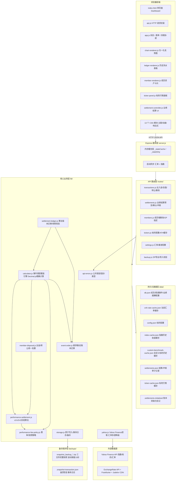
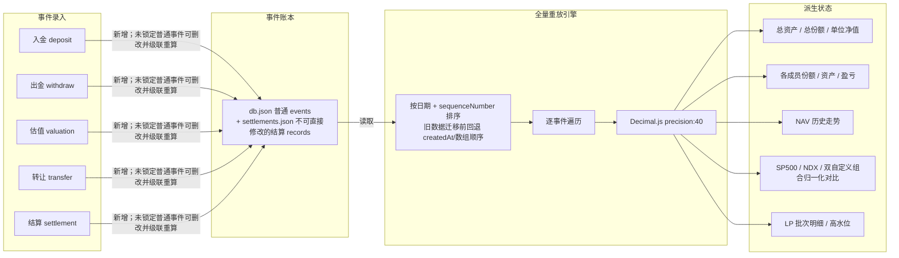
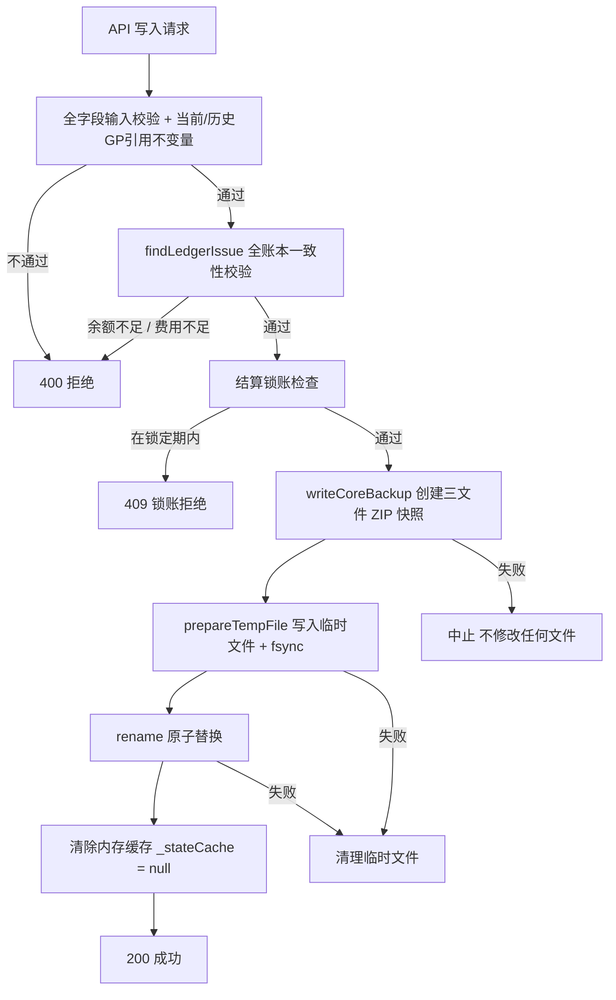
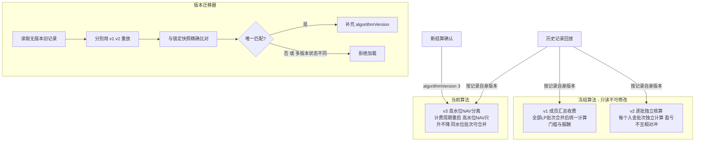
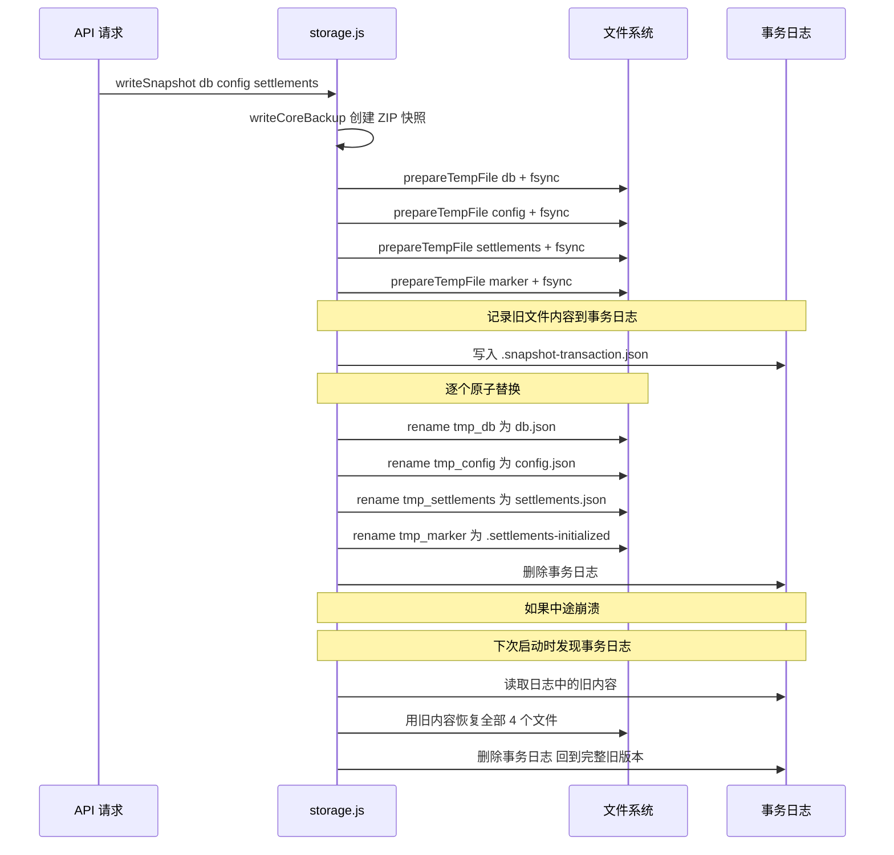
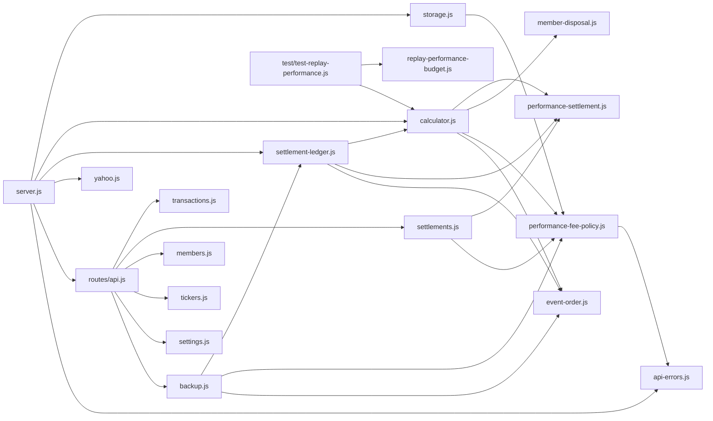
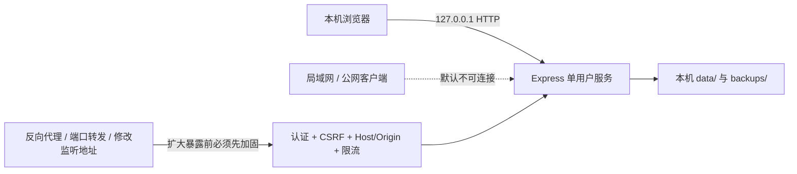

# 系统架构图

## 1. 整体分层架构

---

## 2. 事件溯源核心数据流

---

## 3. 数据写入安全机制

---

## 4. 业绩结算算法版本体系

---

## 5. 三文件原子事务 writeSnapshot

---

## 6. 文件依赖关系

---

## 7. 部署与安全边界

- 默认监听 `127.0.0.1`，当前设计目标是本机、单用户部署；
- CSP 和本地化依赖保护浏览器资源执行边界，不等同于用户身份认证；
- 不得通过反向代理、端口转发或修改监听地址直接暴露服务；
- 任何网络暴露必须先完成 TASK-008，并重新评估 TLS、会话和审计要求。
