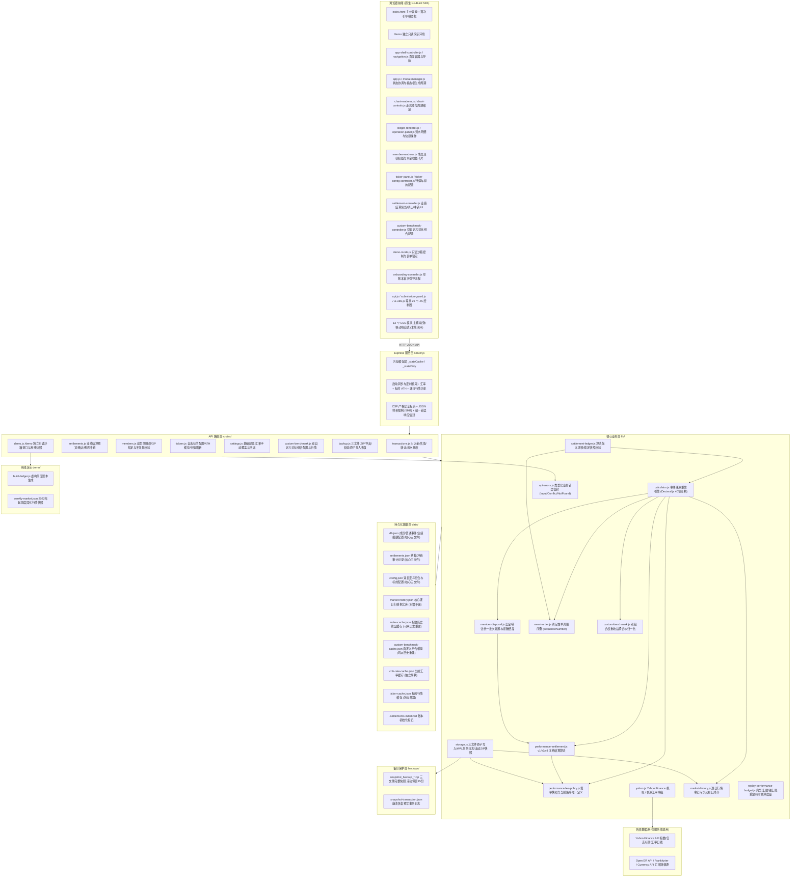
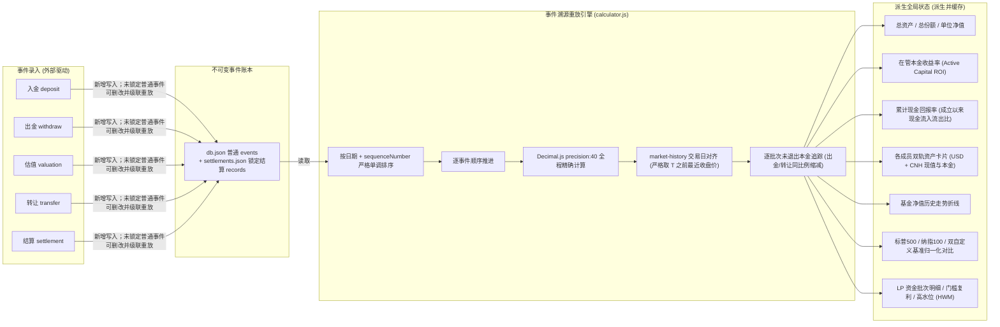
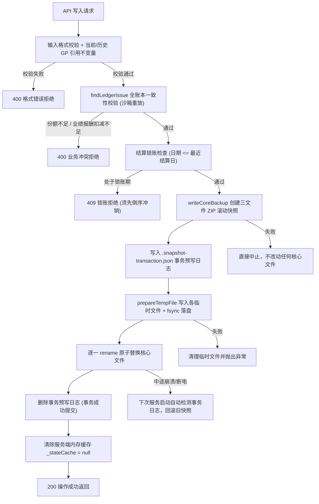
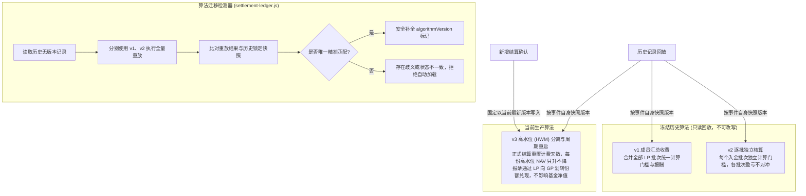
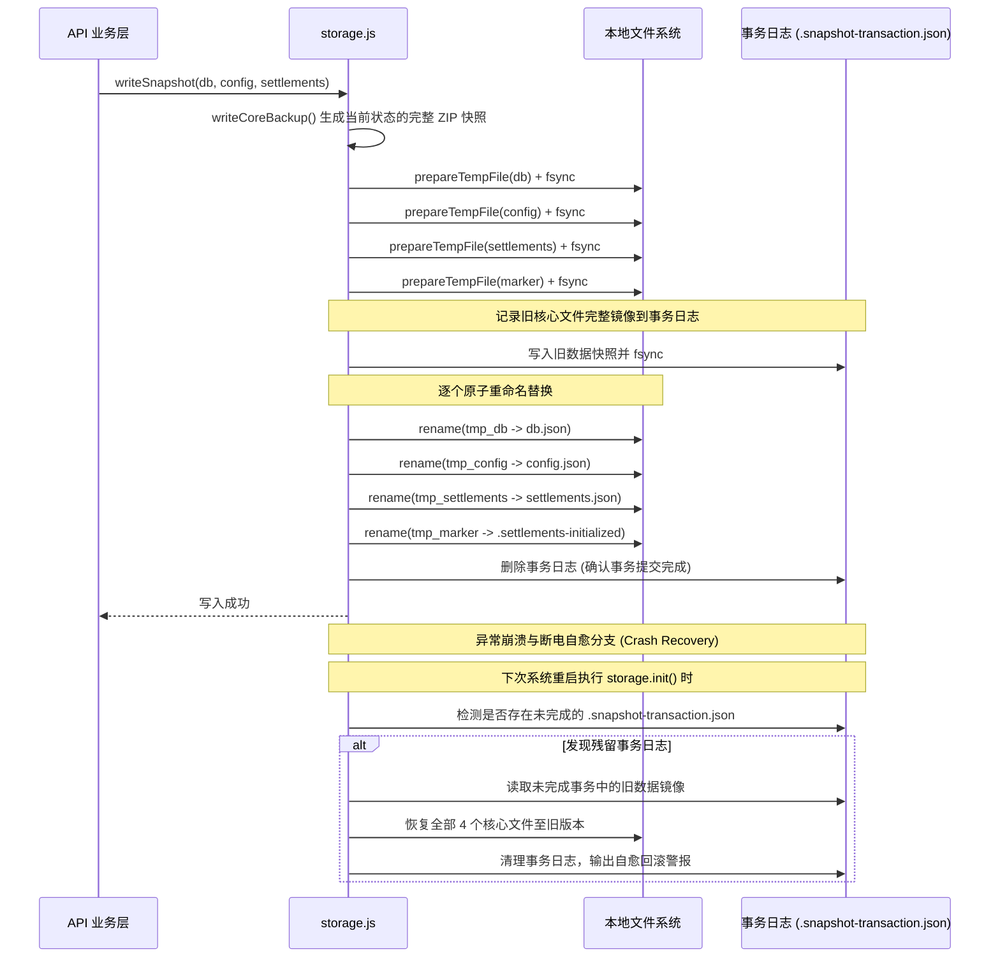
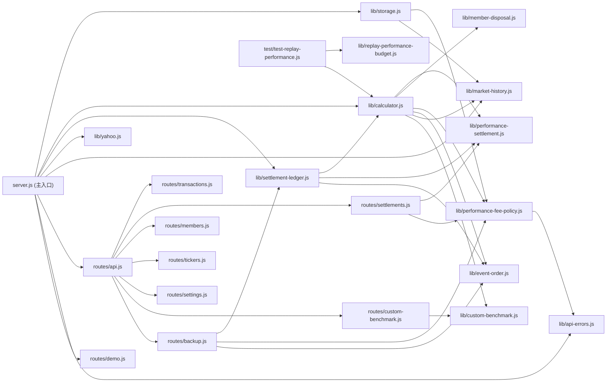
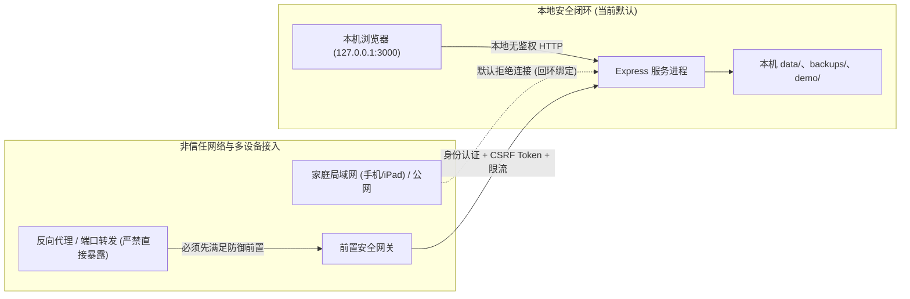

# 系统架构设计白皮书

> **系统版本**：v3.16.1
>
> **最后更新**：2026-09-03
>
> **设计哲学**：正确性绝对优先、事件溯源驱动、金融级精度保真、WAL 事务保障、零外部运维依赖（No-Build & 100% 离线自治）。

---

## 1. 整体分层架构

---

## 2. 事件溯源与双轨收益数据流

---

## 3. 数据写入与事务安全机制

---

## 4. 业绩结算算法版本冻结体系

本系统恪守 **1956 年巴菲特合伙人基金（BPL）契约**（0% 固定管理费、6% 复利门槛、25% 提成、GP 倾囊同投）。历史算法迭代通过冻结版本确保历史审计绝对不可篡改：

---

## 5. 三核心文件原子事务 writeSnapshot

---

## 6. 代码模块依赖拓扑

---

## 7. 部署模型与安全边界约束

### 核心安全治理准则
1. **单机回环专用（Loopback-Only）**：默认且强制仅监听 `127.0.0.1`。当前系统不设用户登录与多租户权限隔离，**绝对严禁直接修改监听地址（`0.0.0.0`）或通过内网穿透/端口转发向局域网与公网暴露**。
2. **CSP 纵深防御**：全站启用严格的 Content Security Policy，彻底移除任何外部 CDN 引用（Chart.js、SortableJS、Inter/Outfit 字体均由本地提供），禁止内联脚本执行（No Inline Scripts），杜绝 XSS 与远程供应链投毒。
3. **跨设备协同前置条件（TD-003）**：若未来需满足家庭成员通过手机/平板查账的需求，必须先在架构层面实现**轻量级只读 Token / 成员口令鉴权**与 CSRF 防御机制。
